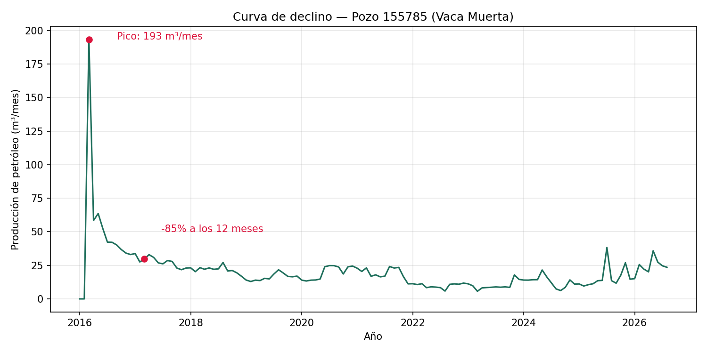
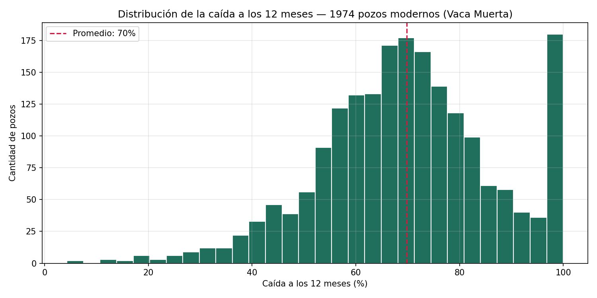
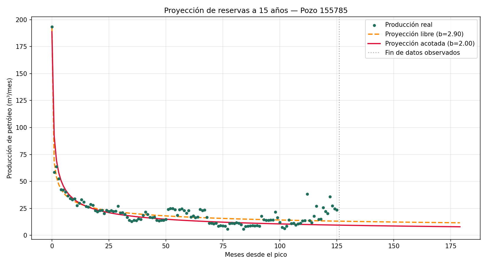

# Curva de declino — Pozos no convencionales de Vaca Muerta

## Objetivo

Proyecto de análisis exploratorio orientado a portfolio que reconstruye, paso a paso y en **Python**, el flujo típico de un análisis de producción de hidrocarburos no convencionales: desde el dato crudo público hasta el cálculo de la **curva de declino** de un pozo de la formación Vaca Muerta.

El foco está puesto en una pregunta concreta del negocio de Oil & Gas: *una vez que un pozo no convencional alcanza su pico de producción, ¿qué tan rápido cae, y cuánto le queda productivo un año después?*

---

## Dataset

Datos públicos de **producción de petróleo y gas por pozo (Capítulo IV)**, publicados por la Secretaría de Energía de la Nación a través del portal [datos.gob.ar](https://datos.gob.ar/dataset/energia-produccion-petroleo-gas-por-pozo-capitulo-iv).

El archivo original (`data/produccion_no_convencional.csv`, ~140 MB) no se versiona en este repositorio por su peso — está excluido vía `.gitignore`. Sí se incluye `data/vaca_muerta_filtrado.csv`, la versión ya filtrada a la formación Vaca Muerta y reducida a las columnas relevantes para este análisis.

El uso de los datos es con fines de demostración y portfolio. La propiedad y actualización del dataset corresponde a la Secretaría de Energía.

---

## Estructura del proyecto

```
vaca-muerta-declino/
├── data/
│   ├── produccion_no_convencional.csv   (no versionado — dataset crudo completo)
│   ├── vaca_muerta_filtrado.csv         (dataset filtrado, formación Vaca Muerta)
│   ├── curva_declino_pozo155785.png     (gráfico final, fase 6)
│   ├── declino_pozos_modernos.csv       (declino de 1.974 pozos modernos)
│   ├── histograma_declino_12m.png       (distribución de caída a 12 meses)
│   ├── clasificacion_pozos_modernos.csv (pozos activos vs. parados)
│   ├── ajuste_arps_pozo155785.png       (ajuste de Arps sin restricciones)
│   ├── ajuste_arps_pozo155785_acotado.png (ajuste de Arps acotado, b ≤ 2)
│   └── comparacion_proyecciones_pozo155785.png (proyección libre vs. acotada, 15 años)
├── notebooks/
└── scripts/
    ├── fase3_paso1_explorar.py
    ├── fase3_paso2_formacion.py
    ├── fase3_paso3_filtrar.py
    ├── fase4_paso1_elegir_pozo.py
    ├── fase4_paso2_revisar_pozo.py
    ├── fase4_paso3_graficar.py
    ├── fase4_paso4_pozos_modernos.py
    ├── fase5_paso1_calcular_declino.py
    ├── fase6_paso1_grafico_final.py
    ├── fase7_paso1_declino_todos_pozos.py
    ├── fase7_paso2_histograma_declino.py
    ├── fase7_paso3_investigar_caidas_100.py
    ├── fase7_paso4_clasificar_pozos.py
    ├── fase8_paso1_ajustar_arps_un_pozo.py
    ├── fase8_paso2_ajustar_arps_acotado.py
    └── fase8_paso3_comparar_proyecciones.py
```

---

## Metodología

El análisis está dividido en fases, cada una como un script independiente y ejecutable:

| Fase | Script | Qué hace |
|---|---|---|
| **3 — Exploración y limpieza** | `fase3_paso1_explorar.py` | Abre el CSV crudo y revisa su forma: filas, columnas, primeras observaciones. |
| | `fase3_paso2_formacion.py` | Cuenta cuántos registros hay por formación geológica. |
| | `fase3_paso3_filtrar.py` | Filtra solo la formación **Vaca Muerta**, se queda con las columnas útiles (`idpozo`, `empresa`, `areayacimiento`, `anio`, `mes`, `prod_pet`, `prod_gas`, `prod_agua`, `tef`, `fecha_data`), audita nulos y guarda el dataset reducido. |
| **4 — Selección del pozo de caso** | `fase4_paso1_elegir_pozo.py` | Identifica los pozos con más meses de historia productiva. |
| | `fase4_paso2_revisar_pozo.py` | Audita la calidad de los datos de un pozo puntual (meses duplicados, continuidad de la serie). |
| | `fase4_paso3_graficar.py` | Primer gráfico exploratorio de la producción mensual del pozo elegido. |
| | `fase4_paso4_pozos_modernos.py` | Acota el universo a pozos que arrancaron en 2016 o después, con suficiente historia para analizar el declino. |
| **5 — Cálculo del declino** | `fase5_paso1_calcular_declino.py` | Calcula el pico de producción, la producción 12 meses después del pico, y la caída porcentual — a los 12 meses y hasta el dato más reciente. |
| **6 — Visualización final** | `fase6_paso1_grafico_final.py` | Arma el gráfico final con el pico y la caída a 12 meses marcados y anotados, listo para presentar. |
| **7 — Declino a escala (todos los pozos modernos)** | `fase7_paso1_declino_todos_pozos.py` | Replica el cálculo de declino del pozo de caso sobre los 1.974 pozos modernos con suficiente historia, guardando pico, caída a 12 meses y caída total de cada uno. |
| | `fase7_paso2_histograma_declino.py` | Grafica la distribución de la caída a los 12 meses en un histograma, con la media marcada. |
| | `fase7_paso3_investigar_caidas_100.py` | Investiga los pozos con caída ≥99% a los 12 meses, cruzando con la columna `tef` (tiempo efectivo de producción) para distinguir agotamiento real de paradas operativas. |
| | `fase7_paso4_clasificar_pozos.py` | Clasifica 2.348 pozos modernos como activos o parados según su último registro de `tef`, y calcula el porcentaje parado. |
| **8 — Ajuste de modelo de declino (Arps)** | `fase8_paso1_ajustar_arps_un_pozo.py` | Ajusta el modelo hiperbólico de Arps (`qi`, `Di`, `b`) a la producción post-pico del pozo, sin restricciones sobre los parámetros. |
| | `fase8_paso2_ajustar_arps_acotado.py` | Repite el ajuste limitando el exponente `b` a un rango físicamente razonable (0–2), para evitar el *"b-factor problem"* típico de los ajustes libres en pozos no convencionales. |
| | `fase8_paso3_comparar_proyecciones.py` | Proyecta ambos ajustes (libre y acotado) 15 años hacia adelante y cuantifica la diferencia en reservas estimadas (producción acumulada). |

---

## Resultados

Caso de estudio: **pozo 155785**, formación Vaca Muerta.

- **Pico de producción:** 193,4 m³/mes (marzo de 2016)
- **Caída a los 12 meses del pico:** -85% (29,7 m³/mes)
- **Caída total hasta el dato más reciente:** -88% (23,5 m³/mes)

Este patrón — una caída muy pronunciada en el primer año, seguida de una cola larga de producción baja pero sostenida — es la firma característica de un pozo no convencional (*shale*), y es la base de cualquier estimación de reservas o planificación de nuevas perforaciones en Vaca Muerta.



### Declino a nivel de todos los pozos modernos

Para contextualizar el caso del pozo 155785, se replicó el cálculo de declino sobre los **1.974 pozos modernos** (iniciados en 2016 o después) con al menos 12 meses de historia posteriores al pico:

- **Caída promedio a los 12 meses:** -69,8% (mediana: -69,5%)
- **Caída total promedio** (hasta el dato más reciente): -85,5%
- **152 pozos (7,7%)** mostraron una caída de 99% o más a los 12 meses. Se investigó una muestra de estos casos cruzando con la columna `tef` (tiempo efectivo de producción) para distinguir entre pozos realmente agotados y pozos simplemente parados por motivos operativos.

Sobre un universo más amplio de **2.348 pozos modernos**, se clasificó cada uno según si seguía activo (`tef > 0`) en su último registro: **el 12,1% estaba parado** al final de su historia disponible — una distinción importante para no confundir "declino natural del yacimiento" con "pozo fuera de servicio" al interpretar las estadísticas agregadas.



### Ajuste del modelo de Arps y el "b-factor problem"

Sobre el mismo pozo 155785 se ajustó el modelo hiperbólico de Arps a la producción post-pico, comparando un ajuste sin restricciones contra uno acotado a los rangos físicamente razonables que usa la industria:

| | qi (m³/mes) | Di (1/mes) | b |
|---|---|---|---|
| Ajuste libre | 193,3 | 6,812 | **2,903** |
| Ajuste acotado (b ≤ 2) | 188,9 | 1,600 | **2,000** |

El exponente `b` del ajuste libre casi triplica el límite superior (b=2) que la industria considera físicamente razonable para pozos no convencionales — un problema conocido como *b-factor problem* en el análisis de curvas de declino. Proyectando ambos ajustes 15 años hacia adelante, el modelo sin restricciones **sobreestima la producción acumulada en un 16%** respecto al modelo acotado, una diferencia con impacto directo en la estimación de reservas (EUR) y en decisiones de inversión sobre el pozo.



---

## Tecnologías

   

---

## Cómo ejecutar

```bash
cd scripts
python fase3_paso1_explorar.py
python fase3_paso2_formacion.py
python fase3_paso3_filtrar.py
python fase4_paso1_elegir_pozo.py
python fase4_paso2_revisar_pozo.py
python fase4_paso3_graficar.py
python fase4_paso4_pozos_modernos.py
python fase5_paso1_calcular_declino.py
python fase6_paso1_grafico_final.py
python fase7_paso1_declino_todos_pozos.py
python fase7_paso2_histograma_declino.py
python fase7_paso3_investigar_caidas_100.py
python fase7_paso4_clasificar_pozos.py
python fase8_paso1_ajustar_arps_un_pozo.py
python fase8_paso2_ajustar_arps_acotado.py
python fase8_paso3_comparar_proyecciones.py
```

Requiere `pandas`, `matplotlib` y `scipy`. El dataset crudo (`produccion_no_convencional.csv`) se descarga de [datos.gob.ar](https://datos.gob.ar/dataset/energia-produccion-petroleo-gas-por-pozo-capitulo-iv) y se coloca en `data/` antes de correr `fase3_paso1_explorar.py`.

---

## Licencia

Este repositorio está bajo licencia MIT. Ver [LICENSE](LICENSE) para más detalles.
